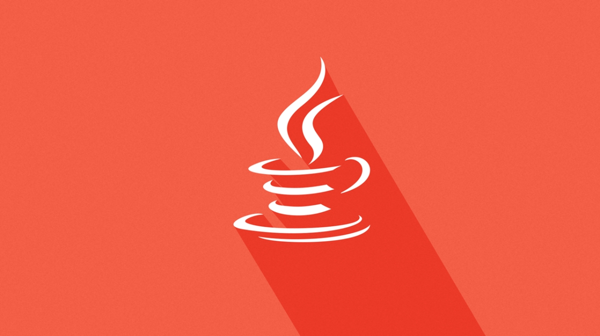

# Meu estudo de Java

## Descrição
Este repositório foi criado para registrar o meu estudo sobre a linguagem de programação Java. Aqui, documentarei meu progresso, projetos, anotações e recursos úteis relacionados ao Java.

## Tópicos de Estudo

- Introdução à linguagem Java
- Tipos de dados, variáveis e operadores
- Estruturas de controle (if, switch, loops)
- Arrays e coleções
- OOP (Programação Orientada a Objetos)
- Tratamento de exceções
- Manipulação de Strings
- Entrada/saída (I/O)
- Bibliotecas padrão e APIs
- Spring Boot

# Projetos

- [Projeto 1]()
- [Projeto 2]()
- [Projeto 3]()

## Recursos Recomendados
- [Documentação Oficial do Java](https://docs.oracle.com/en/java/javase/index.html)
- Curso Online: [Java 2022 COMPLETO: Do Zero ao Profissional + Projetos!](https://www.udemy.com/course/fundamentos-de-programacao-com-java/)

## Contribuições

Sinta-se à vontade para contribuir com este repositório se você tiver recursos, projetos ou anotações relevantes sobre o estudo de Java. Basta abrir um pull request.

## Autor

- Igor Augusto
- E-mail: igoraugustobz@gmail.com
- Conecte-se comigo no [LinkedIn](https://www.linkedin.com/in/igorbrz/).